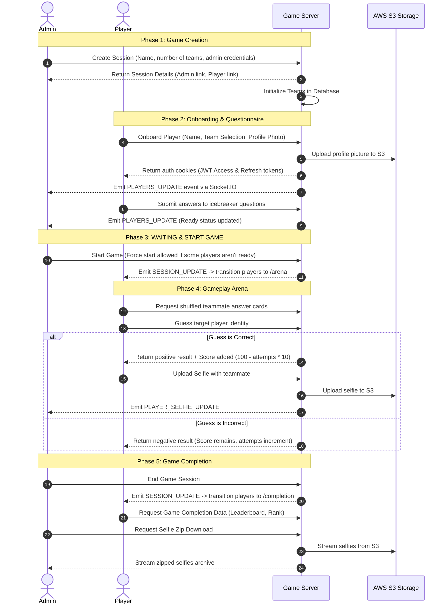
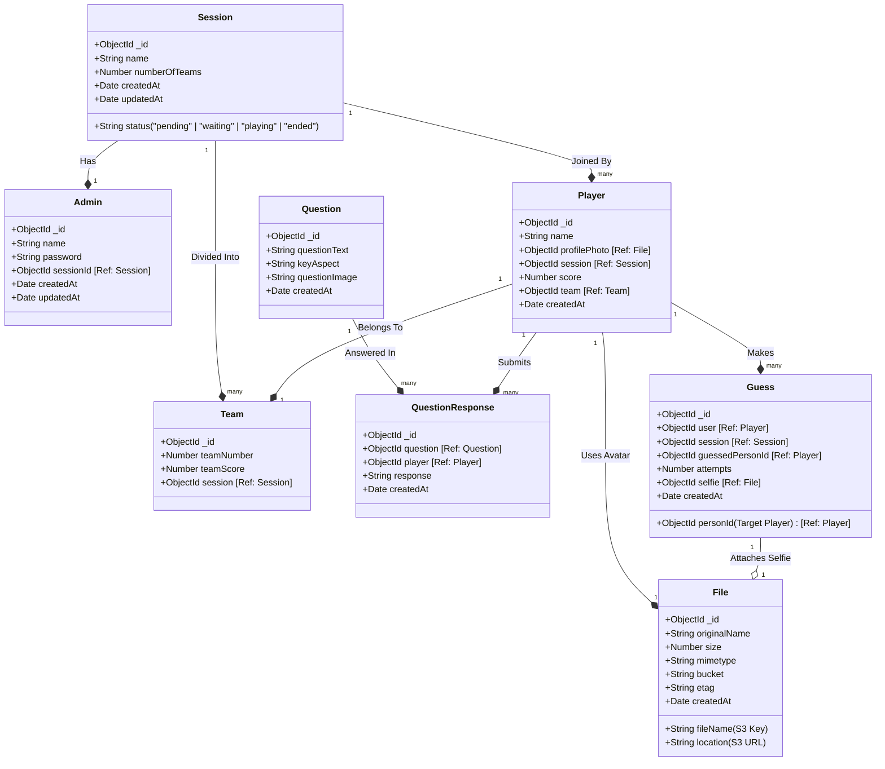

# GetSetKnow! Project Architecture & Codebase Guide

**GetSetKnow!** is an interactive, real-time multiplayer icebreaker and guessing game designed to help team members get to know each other. Players upload their profile photos, answer personality questions, and then guess who answered what amongst their teammates. The game includes real-time dashboards for admins, individual/team scoring, selfie updates on correct guesses, and automated data exports (downloading all selfies as a compressed archive).

---

## 1. Project Overview & Gameplay Flow

The application consists of a sequential, game-state-driven user experience orchestrated between **Player views** and an **Admin panel**.



---

## 2. Technology Stack

### Backend (`server/`)
*   **Runtime & Language:** Node.js with TypeScript (`ts-node-dev` for development, `tsc` for build compilation).
*   **Framework:** Express.js with async handler wrappers for robust error boundaries.
*   **Database:** MongoDB via Mongoose ODM for document persistence.
*   **Real-time Synchronization:** Socket.IO for event-driven client-server updates.
*   **Storage & Media:** AWS SDK v3 (`@aws-sdk/client-s3`) and `multer-s3` for uploading profile photos and selfies.
*   **Utilities:** `archiver` (zipping files on the fly), `jsonwebtoken` & `cookie-parser` (cookie-based authentication), `bcrypt` (admin password hashing).

### Frontend (`client/`)
*   **Runtime & Build Tool:** React (v19) with TypeScript and Vite.
*   **Styling:** Material UI (MUI v7) and custom vanilla CSS (`App.css`, `index.css`).
*   **State Management:** Redux Toolkit (RTK) for local state and RTK Query for declarative, cached data fetching.
*   **Routing:** React Router DOM (v7) for page-level navigation and Auth wrappers.
*   **Real-time Client:** Socket.IO Client for listening to administrative state shifts.
*   **Visual Assets & Motion:** `framer-motion` for micro-animations, `react-confetti` for game completion visual celebrations, and `react-webcam` for custom photo capture.

---

## 3. Database Schema Design (Mongoose)

The data model captures the connections between sessions, admin roles, players, teams, personality questions, and gameplay attempts:



---

## 4. Codebase Directory Structure

### 4.1 Server Structure (`server/src/`)
```
server/src/
├── config/
│   └── db.ts                         # MongoDB connection establishment
├── index.ts                          # Server entrypoint; setups http, Socket.io, Express middlewares
├── middlewares/
│   ├── errorHandler.ts               # Global Express error filter
│   ├── notFound.ts                   # 404 endpoint router
│   ├── socketAuthMiddleware.ts       # Socket connection JWT authorization
│   └── authMiddleware.ts             # REST route JWT authentication & Role validation
├── routes/
│   └── v1/
│       ├── file.routes.ts            # Dynamic S3 file operations
│       └── index.ts                  # Root versioned routes registry
├── services/
│   ├── fileUpload/                   # Config, S3 clients, middlewares, and delete utils
│   └── socket/                       # Socket.IO management (RoomManager, emitters, disconnects)
└── modules/                          # Domain modules
    ├── admin/                        # Admin authorization, dashboards, and leaderboard aggregation
    ├── files/                        # Metadata models for S3 items
    ├── players/                      # Onboarding, guessing logic, scoring, and selfies
    ├── questions/                    # Retrieval of items, submissions, and response storage
    ├── session/                      # Lifecycle of sessions, S3 selfie archiving
    └── teams/                        # Team modeling and automatic allocations
```

### 4.2 Client Structure (`client/src/`)
```
client/src/
├── App.tsx                           # Root app component; handles global routes and Socket.IO initialization
├── main.tsx                          # App runtime mount file
├── app/
│   ├── api.ts                        # RTK Query baseline configuration (with credentials headers)
│   ├── store.ts                      # Redux state registry
│   └── rootReducer.ts                # Combined slice hooks
├── components/
│   ├── auth/
│   │   └── AuthWrapper.tsx           # Session protection (validates player/admin presence)
│   └── ui/
│       ├── button.tsx                # Reusable theme-compliant button
│       ├── Loader.tsx                # Material Spinner
│       └── Default.tsx               # Route fallback handler
├── pages/
│   ├── adminMain.tsx                 # Routing table for administrator components
│   └── gameMain.tsx                  # Routing table for game flow components
├── services/
│   └── websocket/                    # Socket.IO client connections, hooks, and listeners
└── features/                         # Feature directories (modular RTK API slices + UI components)
    ├── admin/                        # Dashboards, PlayerTables, Leaderboards
    ├── game/                         # Arenas, completion dashboards, selfie upload frames
    ├── player/                       # Camera capture frames, HomeScreen forms
    └── question/                     # Questionnaire inputs, text cards, intros
```

---

## 5. Core API Endpoints

### 5.1 Player Module
*   `POST /api/v1/player/onboardPlayer`
    *   **Description:** registers a player into a session, uploads their avatar to S3, selects a team, and returns HTTP-only cookies (`accessToken` and `refreshToken`).
    *   **Auth Required:** None (registers user session).
*   `GET /api/v1/player/fetchPlayer`
    *   **Description:** fetches the authenticated player's credentials and game details.
    *   **Auth Required:** Player.
*   `GET /api/v1/player/getPlayersCards`
    *   **Description:** compiles randomized cards containing teammates' answers to icebreakers.
    *   **Auth Required:** Player.
*   `POST /api/v1/player/submitGuess`
    *   **Description:** checks if a target guess is correct, increments attempts, and calculates score increments (100 minus attempts * 10).
    *   **Auth Required:** Player.
*   `POST /api/v1/player/submitSelfie`
    *   **Description:** uploads a selfie taken with a correctly guessed teammate to S3 and attaches it to the Guess record.
    *   **Auth Required:** Player.

### 5.2 Questions Module
*   `GET /api/v1/player/fetchAllQuestions`
    *   **Description:** lists all available icebreaker questions in the system.
    *   **Auth Required:** Player.
*   `POST /api/v1/player/storeQuestionResponse`
    *   **Description:** saves or updates a player's answer to a specific question.
    *   **Auth Required:** Player.

### 5.3 Admin Module
*   `POST /api/v1/admin/login`
    *   **Description:** logs in admin for a session, checking credentials against hashed session PINs.
*   `GET /api/v1/admin/fetchDashboardData`
    *   **Description:** compiles statistics (counts of total players, readiness indicators, score arrays) for the active dashboard.
    *   **Auth Required:** Admin.
*   `GET /api/v1/admin/checkPlayersReadiness`
    *   **Description:** counts onboarded players and verifies if they have completed the questionnaire.
    *   **Auth Required:** Admin.
*   `PUT /api/v1/admin/updatePlayer`
    *   **Description:** overrides player properties (name, score) directly from the admin dashboard grid.
    *   **Auth Required:** Admin.

### 5.4 Session Lifecycle Module
*   `PUT /api/v1/session/update`
    *   **Description:** modifies session status (`waiting`, `playing`, `ended`) and notifies connected clients via Socket.IO.
    *   **Auth Required:** Admin/System.
*   `GET /api/v1/session/download-selfies/:sessionId`
    *   **Description:** streams files from S3, zips them dynamically using `archiver`, and downloads them to the browser client.
    *   **Auth Required:** Authenticated user.

---

## 6. Real-time Event Management (Socket.IO)

The game coordinates state transitions and statistics displays across screens using real-time socket events:

| Event Name | Directed To | Sender | Description / Payload |
| :--- | :--- | :--- | :--- |
| `SESSION_UPDATE` | All session sockets | Server | Triggered when session status updates (e.g., transitions players from the waiting area to the gameplay arena). |
| `PLAYERS_UPDATE` | Session admins | Server | Triggered when a new player joins or submits a question response, prompting the dashboard to refresh its table. |
| `PLAYER_STAT_UPDATE`| Specific player socket| Server | Dispatched on correct guesses to update the player's local scoring stats. |
| `PLAYER_SELFIE_UPDATE`| Session admins | Server | Notifies the admin dashboard that a new selfie has been uploaded to update the live selfie gallery. |

---

## 7. Configuration & Environment Setup

The application uses S3 credentials and system URLs defined in environment configurations.

### 7.1 Server Setup (`server/.env`)
```env
PORT=5000
NODE_ENV=development
MONGO_URI=mongodb://localhost:27017/getsetknow
FRONTEND_URL=http://localhost:5173
SUPER_ADMIN_SERVER_URL=https://superadmin-server.com
ACCESS_TOKEN_SECRET=your_jwt_access_secret_key
REFRESH_TOKEN_SECRET=your_jwt_refresh_secret_key
AWS_ACCESS_KEY_ID=your_aws_s3_key_id
AWS_SECRET_ACCESS_KEY=your_aws_s3_secret_key
AWS_S3_BUCKET_NAME=your_s3_bucket_name
AWS_REGION=ap-south-1
```

### 7.2 Client Setup (`client/.env`)
```env
VITE_BACKEND_BASE_URL=http://localhost:5000/api/v1
VITE_BACKEND_WEBSOCKET_URL=http://localhost:5000
```
